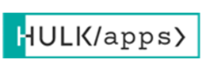

# HULKapps App 🦸

HULKapps is an app built with Ruby on Rails where users can sign up, create, edit, delete, browse posts and comment on those posts.



## Table of Contents

- [Features](#features)
- [Setup Instructions](#setup-instructions)
- [Styling Guide](#styling-guide)
- [Contributing](#contributing)
- [License](#license)

## Features

- **User Authentication**: Secure sign-up and login capabilities made with Devise gem.
- **Post Management**: Create, edit, browse, and delete posts.
- **Comment System**: Engage with other users by commenting on their posts.
- **Profile System**: View and edit user profiles with post and comment count.

## Setup Instructions

1. **Clone the repository**:

   ```bash
   git clone https://github.com/amirdrljevic/hulkapps.git
   cd HULKapps
   ```

2. **Install dependencies**:

   Make sure you have Ruby and Rails 7 installed. Then,

   ```bash
   bundle install
   ```

3. **Setup the database**:

   ```bash
   rails db:create db:migrate
   ```

4. **Seed the database with fake data (optional)**:

   ```bash
   rails db:seed
   ```

5. **Setup Environment Variables**:

   This project uses the dotenv gem to manage environment variables during development and testing.
   Duplicate the .env.example file and rename it to .env:

   ```bash
   cp .env.example .env
   ```

   Open the .env file in your favorite editor and set the appropriate values:

6. **Start the Rails server**:

   ```bash
   rails server
   ```

   Visit `http://localhost:3000` in your browser.

## Styling Guide

Styling is managed through SCSS, ensuring a modern look and feel to the application. The BEM methodology was used along with variables for consistency.

1. **Variables**: All SCSS variables are defined in `variables.scss`. This includes colors, font sizes, and common margins/paddings.
2. **Custom Styles**: Custom styles can be found in `styles.scss`. This includes component-specific styles and utility classes.

3. **Using Bootstrap**: Bootstrap's grid system and components are used for responsiveness. However, the primary color schemes are customized for consistency. Always refer to variables when styling new components.

## Contributing

1. Fork the repository.
2. Create a new branch with an appropriate prefix: e.g., `feature/new-feature` or `bugfix/issue-name`.
3. Make your changes and push them to your forked repository.
4. Create a pull request and provide a detailed description of your changes.

## License

MIT License.
